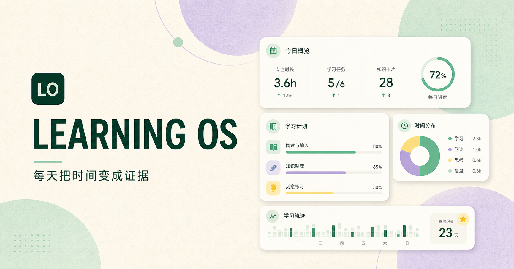
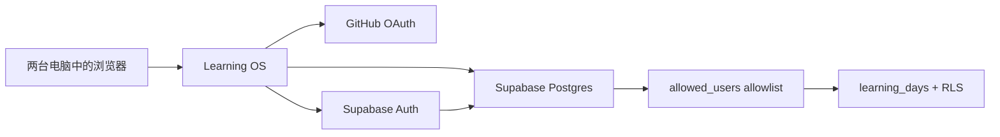

# Learning OS

> 把每天的学习时间，沉淀成可验证的职业证据。

一个面向个人成长的学习看板。它不只记录“今天学了多久”，还记录目标、工程证据、卡点与复盘，并通过 GitHub OAuth 与 Supabase 在多台电脑间同步。



## 为什么做它

职业成长最容易断在两件事上：学习没有留下证据，复盘没有进入下一步行动。Learning OS 试图把每天的输入收敛为一个轻量闭环：

```text
目标 → 投入时间 → 代码/实验/问题记录 → 复盘 → 明日第一步
```

它适合正在构建技术作品集、转型工程能力或希望长期维护学习节奏的个人开发者。

## 功能

- 每日记录：目标、三类学习投入、工程证据、卡点、复盘和闭环状态。
- 能力配比：围绕 Java / AI 应用、云原生 / 平台、算法 / 英语三条主线记录投入。
- 周度概览：显示最近 7 天的累计时长与完成日。
- 跨设备同步：使用自己的 GitHub 身份登录，在自己的 Supabase 项目中保存数据。
- 单账号数据隔离：通过 Supabase Row Level Security（RLS）和允许名单限制读写账户。
- 隐私优先：未配置云端同步时明确处于预览模式，不会伪造“已同步”状态。

## 技术栈

- Next.js / React / TypeScript
- Vinext / Vite
- Supabase Auth（GitHub OAuth）与 Postgres
- Supabase RLS 数据访问控制
- CSS 响应式界面

## 架构



浏览器只使用 Supabase 的匿名公钥。真实记录由 `user_id` 绑定，并且必须同时通过允许名单与 RLS 策略校验；`service_role` 密钥不会出现在前端或仓库中。

## 本地启动

```bash
npm install
copy .env.example .env.local
npm run dev
```

> Windows PowerShell 下，若 `npm run dev` 无法识别环境变量，可执行：
>
> ```powershell
> $env:WRANGLER_LOG_PATH = '.wrangler/wrangler.log'
> .\node_modules\.bin\vinext.cmd dev
> ```

打开 `http://localhost:3000` 即可查看界面。没有 `.env.local` 时应用会以预览模式运行，记录不会写入云端。

## 启用 GitHub 登录和同步

1. 使用自己的账号创建一个 [Supabase](https://supabase.com/) 项目。
2. 在 **Authentication → Providers** 启用 GitHub；按 Supabase 页面提示在 GitHub OAuth App 中填写 Callback URL。
3. 在 Supabase **SQL Editor** 中执行 [`supabase/schema.sql`](./supabase/schema.sql)。
4. 将 `.env.example` 复制为 `.env.local`，填写：

   ```dotenv
   NEXT_PUBLIC_SUPABASE_URL=https://your-project-ref.supabase.co
   NEXT_PUBLIC_SUPABASE_ANON_KEY=your-supabase-anon-key
   ```

5. 启动应用后，使用自己的 GitHub 账号登录一次；到 **Authentication → Users** 复制该用户的 UUID。
6. 在 SQL Editor 执行一次：

   ```sql
   insert into public.allowed_users (user_id) values ('YOUR_AUTH_USER_UUID');
   ```

完成后，只有这个 GitHub 身份可以读取和写入学习记录。其他人即使知道网站地址，也不能访问你的数据。

## 数据与安全边界

- 不要在看板中写入公司账号、密码、IP、网络拓扑、客户信息、内部日志、未脱敏配置或内部代码。
- 不要提交 `.env.local`、Supabase `service_role` 密钥、OAuth secret 或个人导出的数据。
- 免费 Supabase 项目在长期低活动时可能暂停；建议每月导出一次数据库或将周复盘另存为 Markdown。

## 后续计划

- [ ] 月度 / 季度目标与复盘视图
- [ ] 记录导出为 Markdown / JSON
- [ ] GitHub Commit 作为可选的学习证据链接
- [ ] 更细的周趋势与项目里程碑

## License

暂未附加开源许可证。代码仅供学习、展示与交流；如需复用，请先联系仓库所有者。
